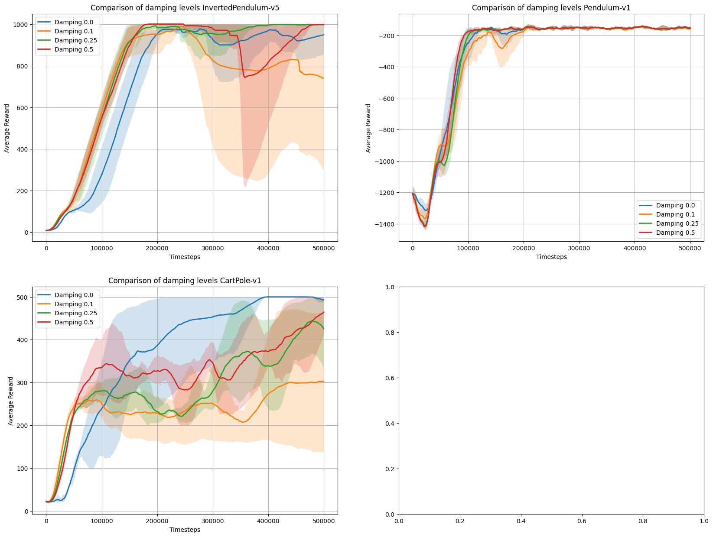
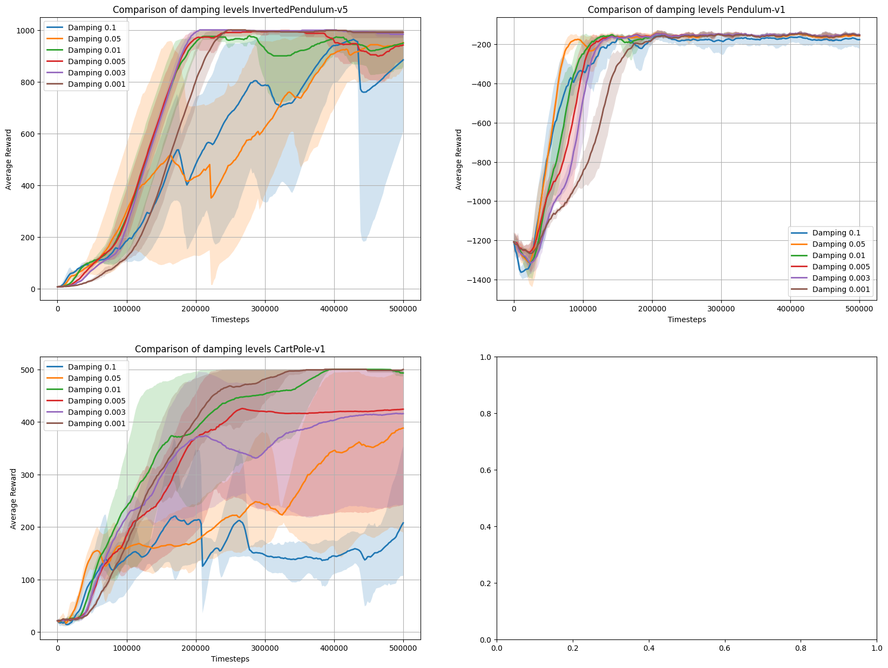

# TRPO Reproduction & Exploration

----------

## Reproduction results

Running on several environments from Gymnasium shows that the model is able to learn and solve certain environments. The experiments are ran over 4 seeds, the hyperparameters stay the same between each environments, except the line searching coefficient `c` and `init`, and there is no damping used. The plots show the mean as the solid line and the the shaded areas show the 95% confidence intervals. 

**Cartpole-v1**

`n-steps = 2048`
`c = 0.8`
`init = trpo`

**Pendulum-v1**

`n-steps = 512`
`c = 0.8`
`init = none`

**InvertedPendulum-v5**

`n-steps = 2048`
`c = 0.5`
`init = none`

**Hopper-v4**

`n-steps = 2048`
`c = 0.8`
`init = trpo`

The first three environments show that my TRPO implementation is able to learn and solve simple environments quite easily, attesting to its correctness. However, the model has more trouble learning in more complicated environments such as Hopper. Some reasons could be:
- Hyper parameter tuning
- Lack of obs/reward normalization
- Effective batch sizes are not large enough

The model seems quite sensitive to how the data is gathered. For example if the data is just a singular episode of the environment, the results are more volatile, which probably comes from the increased variance. Having a batch size which is larger than the max episode length was also somewhat important (specifically `n-steps` > max episode size). This seems logical, as larger batch sizes will lead to better gradient updates. It's also important to use a lower variance method to compute the returns, as full MC returns were often unstable, hence the use of the critic to compute returns. I suspect switching to GAE would solve many of these problems.

Some other things that I noticed were: 
- Initialization of the actor network is quite important. Different intialization led to different performances. Specifically the "trpo" initialization was necessary for the Cartpole env to converge. 
- Usually multi-env didn't help much with learning, and sticking to a single env with a eff batch size was more effective. 
- Initialization of the conjugate method is not that important I tried, both zeros and random normal initialization, but the results were similar. 
- Comparison with original TRPO is difficult to intrepret, but comparison with DDPG from CleanRL shows improvement in InvertedPendulum, but a drastic decline in Hopper. I also compared with SB3-contrib version of TRPO and results are similar, or better in the case of Hopper-v4 (though singular seed & hyperparameters kept the same).
- Most implementations use GAE, but I tried to keep to the paper and don't use that.

-----------------

### Inclusion of damping 

Damping can be added to able for a more stable CG computation. The CG + damping works by solving [2]:

$$(A + \lambda I)x = g$$
instead of 
$$Ax = g$$

This stablizes the eigenvalues (preventing them from going to 0) and allows for a more stable CG computation. I explored how different values of damping affect performance in InvertedPendulum-v5/CartPole-v1/Pendulum-v1.

Clearly there is no one solution to choosing to use damping or not. It seems in continous environments such as pendulum and inverted pendulum damping has a positive effect at around 0.25, but for discrete environments we see a drastic decrease in the final performance, sample efficiency and training stability. This is somewhat unexpected as I would expect the fisher matrix to be less smoother for discrete envs, and would be helped by the damping, whereas the continuous envs would not be as benefitted. However, the opposite is observed, which is somewhat interesting and hard to explain. Perhaps the ill-defined eigenvalues are being dominated by inclusion of the damping term, but I'm not sure without more extensive testing. Note that the CIs are overlapping, which means that these results are not fully stastically significant (just a caveat).

### Trust region size comparison 

I also compare how different sizes of trust region affect learning and final score performance. Specifically, it seems interesting to test if we change the trust region to high and low values, checking if TRPO how effective TRPO stays in the extremes. 

These results are similar to what one would expect. For example I would expect that a lower trust region leads to more stable updates at the cost of sample efficiency, and vice versa for higher trust region. For Inverted Pendulum and Cartpole this is exactly what happens. For Pendulum the results are less pronounced as each configuration solves the environment quite easily, but we still see the same patterns. We also see that a trust region that's too high leads to collapse, and the model is not able to solve the environment. This highlights the importance of the small step in the policy space. As above, the results are overlapping putting the stastitical significance in doubt. 

------------
## References

[1] Schulman, J., Levine, S., Abbeel, P., Jordan, M. I., & Moritz, P. (2015). Trust region policy optimization. Proceedings of the 32nd International Conference on Machine Learning, 37, 1889–1897
[2] https://docs.backpack.pt/en/master/use_cases/example_cg_newton.html
<!-- Notes 

- intialization of conugate gradients does not matter
- it trained much better from the async rollout with different envs vs when I had a single env
- damping may be important
