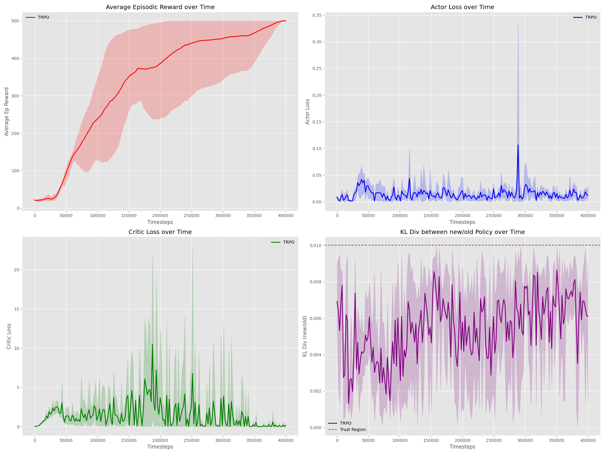
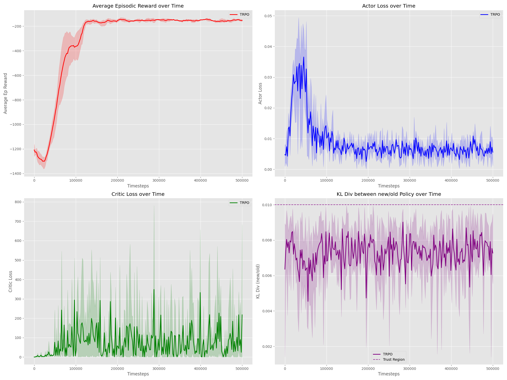
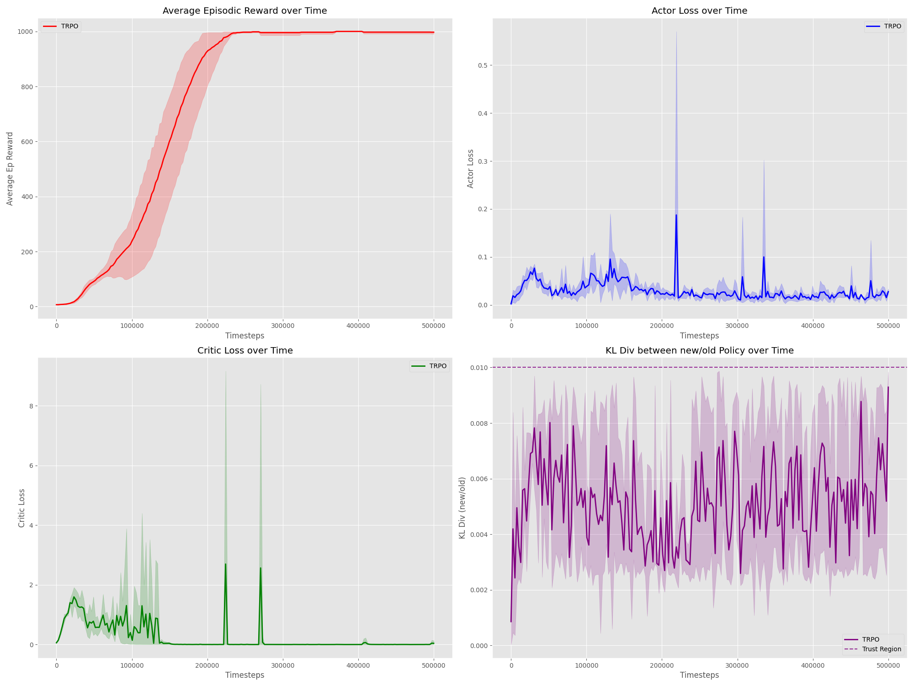
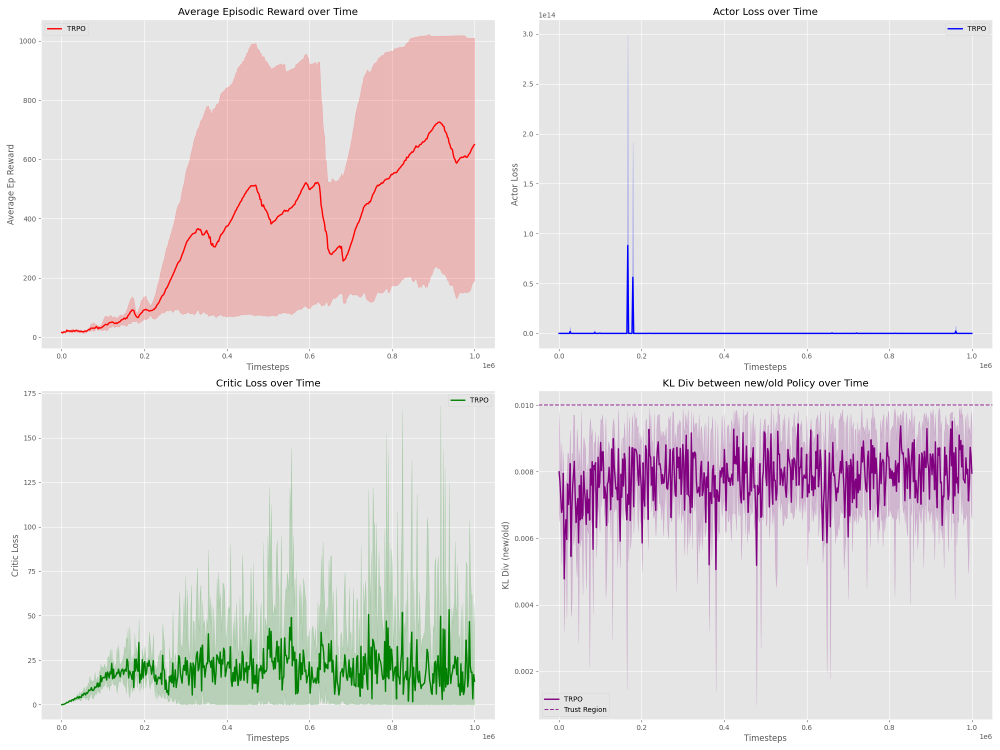

# TRPO Reproduction & Exploration

----------

### Reproduction results

Running on several environments from Gymnasium shows that the model is able to learn and solve certain environments. The experiments are ran over 4 seeds, the hyperparameters stay the same between each environments, except the `n-steps`, line searching coefficient `c` and `init`, and there is no damping used. 

**Cartpole-v1**

`n-steps = 2048`
`c = 0.8`
`init = trpo`

**Pendulum-v1**

`n-steps = 512`
`c = 0.8`
`init = none`

**InvertedPendulum-v5**

`n-steps = 1024`
`c = 0.5`
`init = none`

**Hopper-v4**

`n-steps = 2048`
`c = 0.8`
`init = trpo`

The first three environments show that my TRPO implementation is able to learn and solve simple environments quite easily, attesting to its correctness. However, the model has more trouble learning in more complicated environments such as Hopper. Some reasons could be:
- Hyper parameter tuning
- Lack of obs/reward normalization
- Effective batch sizes are not large enough

Some other things that I noticed were: 
- Initialization of the actor network is quite important. Different intialization led to different performances. Specifically the "trpo" initialization was necessary for the Cartpole env to converge. 
- Usually multi-env didn't help much with learning, and sticking to a single env with a eff batch size was more effective. 
- Initialization of the conjugate method is not that important I tried, both zeros and random normal initialization, but the results were similar. 
- Comparison with original TRPO is difficult to intrepret, but comparison with DDPG from CleanRL shows improvement in InvertedPendulum, but a drastic decline in Hopper. I also compared with SB3-contrib version of TRPO and results are similar, or better in the case of Hopper-v4 (though singular seed & hyperparameters kept the same).
- Most implementations use GAE, but I tried to keep to the paper and don't use that.

-----------------
### Inclusion of damping 

Damping can be added to able for a more stable CG computation. The CG + damping works by solving [2]:

$$(A + \lambda I)x = g$$
instead of 
$$Ax = g$$

This stablizes the eigenvalues and allows for a more stable CG computation. I explored how different values of damping affect performance in InvertedPendulum-v5/CartPole-v1/Pendulum-v1.

[1] Schulman, J., Levine, S., Abbeel, P., Jordan, M. I., & Moritz, P. (2015). Trust region policy optimization. Proceedings of the 32nd International Conference on Machine Learning, 37, 1889–1897
[2] https://docs.backpack.pt/en/master/use_cases/example_cg_newton.html
<!-- Notes 

- intialization of conugate gradients does not matter
- it trained much better from the async rollout with different envs vs when I had a single env
- damping may be important
